# Итоговое задание №8
## Содержание

1. [Условия задания](#title1)
2. [Порядок выполнения](#title2)
3. [Проверка выполнения](#title3)
4. [Контакты](#title4)

## <a id="title1">Условия задания</a>
Есть csv файл, расположенный по [ссылке](https://disk.yandex.ru/d/bhf2M8C557AFVw). Скачивайте. Размер распакованного файла около 300 Мб. Количество строк - 590708 строк.

### Данные в файле:
* **ID объекта** (например, 590707)
* **Координаты** (Широта, Долгота) (например, 55.060199, 32.695577)
* **Год постройки** (например, 1953.0)
* **Площадь** (например, 585.60)
* **Количество этажей** (например, 18)
* **Область и город** (например, Смоленская область, Ярцево)
* **Адрес** (например, "ул. Братьев Шаршановых, д. 61")
* **Описание объекта** (например, "Жилой дом в Ярцево, по адресу ул. Братьев Шаршановых, д. 61, 1953 года постройки, под управлением ТСЖ «Шаршановых».")
### Что необходимо сделать?

**-1. Обратите внимание, что в проекте используются PySpark и Clickhouse. PySpark в airflow в docker-compose нету! 
Его необходимо добавить самостоятельно. Куда вставить в docker-compose - задача самостоятельная.** 

**0. Предварительно разверните docker-compose из первых степов! Шаги 1-7 должны быть сделаны в DAG.**

1. Загрузите файл данных в DataFrame PySpark. Обязательно выведите количество строк.

2. Убедитесь, что данные корректно прочитаны (правильный формат, отсутствие пустых строк).

3. Преобразуйте текстовые и числовые поля в соответствующие типы данных (например, дата, число).

4. Вычислите средний и медианный год постройки зданий.

5. Определите топ-10 областей и городов с наибольшим количеством объектов.

6. Найдите здания с максимальной и минимальной площадью в рамках каждой области.

7. Определите количество зданий по десятилетиям (например, сколько зданий построено в 1950-х, 1960-х и т.д.).

**С данными поработали, проанализировали, теперь можно их и в БД положить.** 

8. Создайте схему таблицы в ClickHouse, которая будет соответствовать структуре ваших данных. Это можно сделать не через airflow.

9. Настройте соединение с ClickHouse из скрипта, учтите, что сделать это необходимо в airflow.

10. Загрузите обработанные данные из DataFrame в таблицу в ClickHouse (airflow)

11. Выполните SQL скрипт в Python, который выведет топ 25 домов, у которых площадь больше 60 кв.м (airflow)

**В качестве решения необходимо прислать ссылку на репозиторий. Обратите внимание на критерии (их 4) сдачи проекта -**

1. **Оформление.** Репозиторий оформлен так, как нужно. А именно есть структура, удобное содержание, читаемый README, естественно наличие условия задания. Обязательно наличие docker-compose. Обязательно наличие скрипта py, код в котором обернут в DAG.

2. **Логика.** Все сделано в одном скрипте. Сначала читаем данные с csv, потом преобразуем данные, анализируем, загружаем в кликхаус, читаем с кликхауса. Все при этом находится в Airflow. Откуда загружать csv - думаем или гуглим (а лучше оба сразу действия делать)

3. **Содержание.** Файл c csv хранить в GIT нельзя! Добавляйте либо ссылку, либо срез данных.

4. **Корректность.** Данные нельзя редактировать, файл нельзя обрезать. Результаты аналитики и SQL скрипта должны быть правильными.

## <a id="title2">Порядок выполнения</a>
1. Создаем дерриктории:

* config
* dags
* data
* drivers
* logs
* plugins

2. Скачиваем и подкладываем нужные файлы и документы:
* [Ссылка на jdbc драйвер](https://disk.yandex.ru/d/RLGROjsLtaSyZw) - .jar файл кладем в [drivers](drivers)
* [Ссылка на csv файл](https://disk.yandex.ru/d/bhf2M8C557AFVw) - .csv файл кладем в [data](data)
* Файл [main.py](main.py) кладем в [dags](dags)

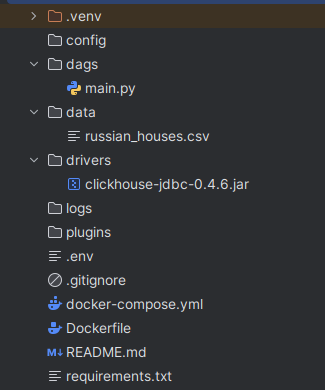

3. Собираем образ из [Dockerfile](Dockerfile) командой 

`docker build - t airflow-with-java-spark`

4. Запускаем [docker-compose.yml](docker-compose.yml) командой 

`docker compose up`

## <a id="title3">Проверка выполнения</a>
1. Переходим по ссылке: http://0.0.0.0:8080/home

* логин: airflow
* пароль: airflow

2. Наблюдаем DAG под названием "main":
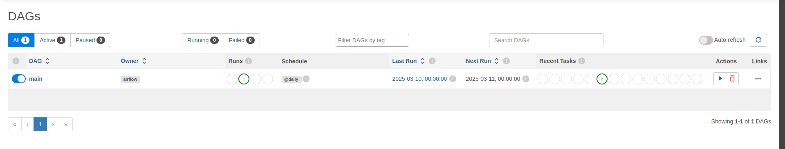
3. Жмем на запуск:  
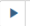  
4. Нажатием на сам DAG "main" и видим всю информацию о нем (Graph, Logs ...):
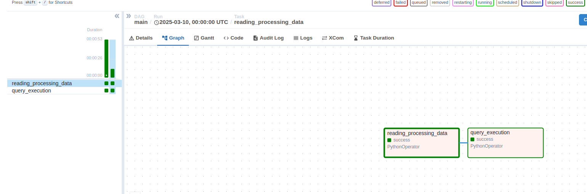
Видим что DAG уже выполнен (темно-зеленый цвет)
5. Переходим в ссылку Logs и наблюдаем что все прошло успешно:
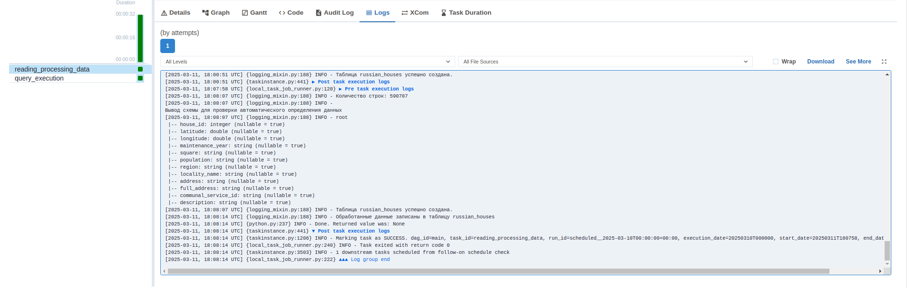
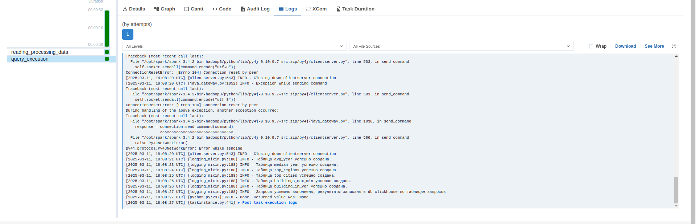
6. Теперь проверим саму db и наполненные таблицы (я использую DBeaver):
   * Подключаемся к db ClickHouse и видим наши таблицы:  
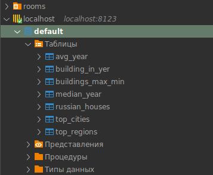
   * Проверим наличие данных в таблицах:
     - Обработанные данные из csv файла:
     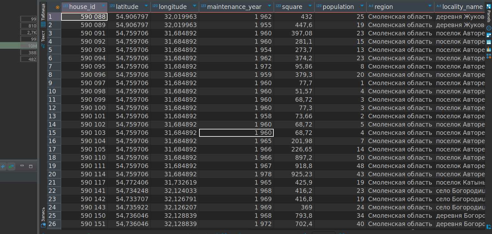
     - Средний год постройки зданий:  
     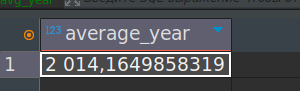
     - Медиальный год постройки зданий:  
     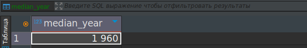
     - Топ-10 областей с наибольшим количеством объектов:  
     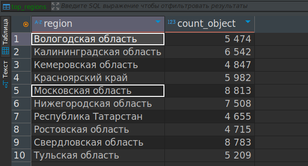
     - топ-10 городов с наибольшим количеством объектов:  
     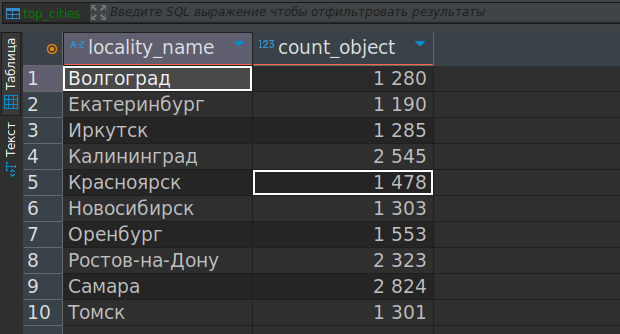
     - Здания с максимальной и минимальной площадью в рамках каждой области:  
     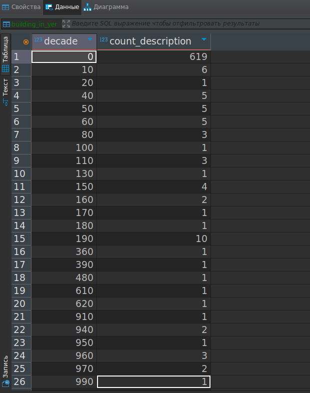
     - Количество зданий по десятилетиям:  
     

## <a id="title4">Контакты</a>
* email: [goodboy873@yandex.ru](mailto:goodboy873@yandex.ru)
* Telegram: [good_boy378](https://t.me/good_boy378)

   