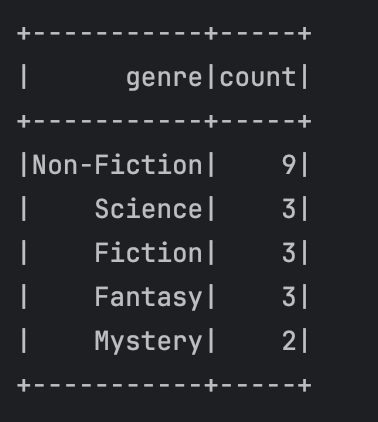

# Самостоятельное задание  №2. Книги и авторы
У вас есть два набора данных: информация о книгах и информация об авторах. Вам нужно объединить эти данные и провести анализ, чтобы найти различные статистики о книгах и авторах.

**Данные**  
1. **Таблица** `books`:

- `book_id`: ID книги
- `title`: Название книги
- `author_id`: ID автора
- `genre`: Жанр книги
- `price`: Цена книги
- `publish_date`: Дата публикации (в формате YYYY-MM-DD)
2. **Таблица** `authors`:

- `author_id`: ID автора
- `name`: Имя автора
- `birth_date`: Дата рождения автора (в формате YYYY-MM-DD)
- `country`: Страна автора
- 
Выполните следующие пункты по порядку. 

1. **Чтение данных**:

- Загрузите данные из CSV файлов в DataFrame. CSV файл books можно скачать по ссылке - https://disk.yandex.ru/d/7ObST0hRb5E4qA , а authors по ссылке - https://disk.yandex.ru/d/jAQHt61PtyxVvg
2. **Обработка данных**:

- Преобразуйте столбцы publish_date и birth_date в формат даты.
3. **Объединение данных**:

- Объедините таблицы books и authors по author_id.
4. **Анализ данных**:

- Найдите топ-5 авторов, книги которых принесли наибольшую выручку.
- Найдите количество книг в каждом жанре.
- Подсчитайте среднюю цену книг по каждому автору.
- Найдите книги, опубликованные после 2000 года, и отсортируйте их по цене.
5. **Результаты**:

- Выведите результаты анализа в виде таблиц.

<ins>Результат 4.1</ins>

<ins>Результат 4.2</ins>

 

<ins>Результат 4.3</ins>

<ins>Результат 4.4</ins>

